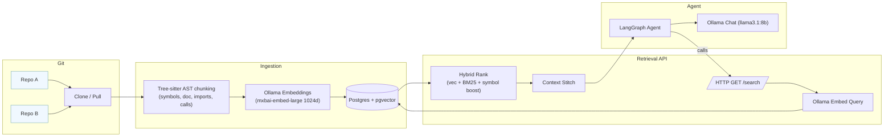

# RAG Codebase on Postgres + pgvector (Ollama-powered)

Local, production-ready Retrieval-Augmented Generation (RAG) for **code repositories** (TypeScript, Java, Node.js) using:

- **Postgres 16 + pgvector** for hybrid retrieval (vector + lexical + symbol boosts)
- **Tree-sitter** for AST-aware chunking (function/class-level)
- **Ollama** (local) for **embeddings** and **chat**
- **FastAPI** retrieval service + a tiny **LangGraph** agent

---

## What you get

- **Clean schema** for repos → files → code chunks (+ AST metadata)
- **Hybrid search**: vector similarity + BM25/tsvector + symbol/name boosts
- **Local-only models**: embeddings via Ollama’s `mxbai-embed-large` (1024-dim), chat via `llama3.1:8b`
- **Simple ingestion**: clone/parse/chunk/embed/index
- **Agent**: minimal graph that retrieves & answers with stitched, provenance-rich context

---

##  Repository layout

```
rag-pgvector/
├─ Dockerfile
├─ .dockerignore
├─ .gitignore
├─ docker-compose.yml
├─ .env.example
├─ db/
│  └─ migrations/001_init.sql
├─ app/
│  ├─ requirements.txt
│  ├─ db.py
│  ├─ ingest.py
│  ├─ api.py
│  └─ agent_graph.py
└─ Makefile           # optional, not required by the compose flows
```

---

##  Architecture (high-level)



---

##  Prerequisites

- Docker & Docker Compose
- (Optional) Native Ollama on host if you don’t want the containerized Ollama
- Ports available: `5432` (Postgres), `11434` (Ollama), `8000` (API)

---

## ⚙️ Configuration

Copy and edit environment variables as needed:

```bash
cp .env.example .env
```

Key envs (can also be set inline or in compose):
- `DB_DSN`: `postgresql://rag:ragpwd@pg:5432/ragdb`
- `OLLAMA_BASE_URL`: `http://ollama:11434` (or `http://host.docker.internal:11434` to use host’s Ollama)
- `EMB_MODEL`: `mxbai-embed-large` (1024-dim)
- `EMB_DIM`: `1024`
- `LLM_MODEL`: `llama3.1:8b`

> **Note on dimensions:** The DB schema sets `embedding vector(1024)`. If you use a different embedding model (e.g., 768-dim), update both the env and DB column type accordingly (see “Changing embedding dimension” below).

---

##  Quickstart

### 1) Bring up core services (Postgres + Ollama + API)

```bash
docker compose up -d pg ollama
# initialize schema (one-shot)
docker compose --profile init up migrate
# start the API service
docker compose up -d app
```

This will:
- Start Postgres with pgvector
- Start Ollama (empty cache initially)
- Run the schema migration
- Start the FastAPI retrieval service on `http://localhost:8000`

### 2) Pull models into Ollama

In another terminal:

```bash
# Embedding model (matches 1024-d schema)
docker exec -it ollama ollama pull mxbai-embed-large

# Chat model for the agent (choose as you like)
docker exec -it ollama ollama pull llama3.1:8b
```

> If using host Ollama, run `ollama pull ...` on your host instead.

### 3) Ingest repositories

```bash
REPO_URLS="https://github.com/expressjs/express.git,https://github.com/spring-projects/spring-petclinic.git" \
docker compose --profile ingest up --exit-code-from ingest ingest
```

This clones, parses, chunks, embeds, and indexes code into Postgres.

### 4) Try the retrieval API

```bash
curl "http://localhost:8000/search?q=jwt%20verification&language=java"
```

You’ll get:
- `results[]` (top chunks with repo/path/lines/symbols/scores)
- `stitched_context` (ready to inject into prompts)

### 5) Run the tiny agent locally

```bash
docker compose exec app python /workspace/app/agent_graph.py
# Then type a question, e.g., "Where is JWT verification implemented?"
```

---

## 🔌 API Reference

`GET /search`

**Query params**
- `q` *(required)*: user query (natural language or symbol)
- `repo` *(optional)*: restrict to a single repo name
- `language` *(optional)*: `typescript` | `javascript` | `java`
- `top_k` *(default 12)*
- `w_vec`, `w_lex`, `w_sym`: weights for hybrid scoring (defaults `0.65/0.25/0.10`)

**Response**
```json
{
  "results": [
    {
      "id": 123,
      "repo_name": "spring-petclinic",
      "path": "src/main/java/.../JwtFilter.java",
      "language": "java",
      "symbol_name": "doFilter",
      "symbol_kind": "function",
      "symbol_signature": "public void doFilter(...)",
      "start_line": 12,
      "end_line": 90,
      "score": 1.234,
      "content": "..."
    }
  ],
  "stitched_context": "// spring-petclinic:src/...:12-90 [public void doFilter(...)]\n..."
}
```

**How to use in agents**  
Inject `stitched_context` into the system/context section of your prompt. The agent can cite provenance that’s already embedded as comments (`repo:path:start-end`).

---

##  Schema Overview

**Tables**
- `rag.repositories` ⇒ one per repo
- `rag.commits` ⇒ commit metadata
- `rag.files` ⇒ file metadata (language, size, test flag)
- `rag.code_chunks` ⇒ **the core**: function/class or windowed chunks  
  - content, `embedding vector(1024)`, `content_tsv` (lexical), `symbol_name`, `symbol_kind`, `symbol_signature`, `doc_comment`, `imports JSONB`, `calls JSONB`, `committed_at`, `valid_from`, `valid_to`
- `rag.chunk_edges` ⇒ optional relations (`calls`, `imports`, `implements`, `tests`)
- `rag.v_chunk_search` ⇒ view joining chunks ↔ files ↔ repos

**Indexes**
- `GIN(content_tsv)` for lexical/BM25
- `IVFFLAT` on `embedding` (cosine) for ANN
- btree on symbol fields and GIN on JSONB `imports`/`calls`

---

##  Retrieval Strategy (Hybrid)

- **Vector**: cosine similarity on pgvector (query embedded via Ollama)
- **Lexical**: `ts_rank_cd` over a `simple` + `unaccent` tsvector of code text
- **Symbol boost**: direct hits on `symbol_name` or `symbol_signature`
- **Ordering**: `hybrid_score = w_vec*vec + w_lex*lex + w_sym*sym_boost`

Tuning knobs are exposed via query params (`w_vec`, `w_lex`, `w_sym`, `top_k`).

---

##  Changing embedding dimension (if you use another model)

Current schema assumes **1024-dim** (`mxbai-embed-large`). To switch:

1) Choose a new Ollama embedding model (e.g., `nomic-embed-text` at 768-dim).
2) Update env:
   ```
   EMB_MODEL=nomic-embed-text
   EMB_DIM=768
   ```
3) Adjust DB column (dev workflow):
   ```sql
   -- Empty the table if re-ingesting from scratch:
   TRUNCATE rag.code_chunks;
   DROP INDEX IF EXISTS code_chunks_embedding_ivfflat;
   ALTER TABLE rag.code_chunks ALTER COLUMN embedding TYPE vector(768);
   -- Recreate ANN index with the same or tuned params:
   CREATE INDEX code_chunks_embedding_ivfflat
     ON rag.code_chunks USING ivfflat (embedding vector_cosine_ops) WITH (lists=100);
   ANALYZE rag.code_chunks;
   ```
4) Re-ingest.

> If you want to keep existing data, you’ll need to recompute embeddings to the new size.

---

##  Production Hardening

- Put **auth** (API keys/JWT) in front of `/search`
- Use **read-only DB roles** for the API
- Enable **SSL** for Postgres (or run inside a trusted network)
- Add **webhook/cron ingestion**, **idempotent staging**, **soft-deletes**, and **partitioning** for very large repos
- Consider **HNSW** indexes if your pgvector build supports it (great online insert performance)

---

##  Troubleshooting

- **“dimension mismatch” / `cannot convert 1024-d to 768-d`**  
  Your embedding model dimension and `vector(N)` must match. See **Changing embedding dimension**.

- **Ollama healthcheck failing**  
  Ensure the `ollama` container has pulled the models:
  ```bash
  docker logs -f ollama
  docker exec -it ollama ollama list
  docker exec -it ollama ollama pull mxbai-embed-large
  ```

- **Slow queries after big ingests**  
  Re-ANALYZE:
  ```sql
  ANALYZE rag.code_chunks;
  ```
  Increase IVFFLAT `lists` (e.g., 100 → 200) and reindex.

- **No results for symbol queries**  
  Try including exact method/class names; symbol boosts rely on `symbol_name`/`symbol_signature`.

---

## 🧠 Using with Strands (agentic)

- Register the retrieval endpoint as a **tool** your Strands agent can call:
  ```
  GET http://<host>:8000/search?q={user_query}
  ```
- Inject `stitched_context` into the agent’s system/context.
- Optional: pass `language`, `repo` based on task context to reduce noise.

---

## License

Choose a license (e.g., MIT) and add it as `LICENSE`. If unsure, MIT is a good default for open source templates.

---

##  Contributing

Issues and PRs welcome!
- Add language parsers (Python/Go/etc.)
- Improve AST extraction (use tree-sitter queries per language)
- Add PR preview indexes and diff-driven ingestion
- Add HNSW index path & benchmarks

---

##  Commands Reference

```bash
#Build the app locally, so that the tag exists
docker compose build app

# Start Postgres + Ollama, pull models into ollama
docker compose up -d pg ollama
docker compose --profile init run --rm ollama-init

# Run migration once to create db with tables extension etc
docker compose --profile init run --rm migrate

# Start API
docker compose up -d app

# Pull models into Ollama (containerized)
docker exec -it ollama ollama pull mxbai-embed-large
docker exec -it ollama ollama pull llama3.1:8b

# Ingest repos (one-shot)
REPO_URLS="https://github.com/expressjs/express.git,https://github.com/spring-projects/spring-petclinic.git" \
docker compose --profile ingest up --exit-code-from ingest ingest

# Test search
curl "http://localhost:8000/search?q=jwt%20verification&language=java"

# Run the mini agent
docker compose exec app python /workspace/app/agent_graph.py
```
