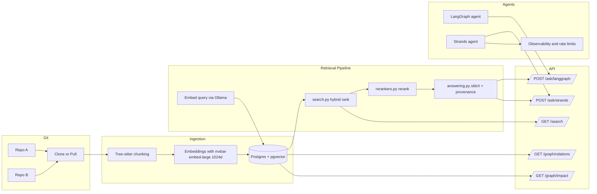
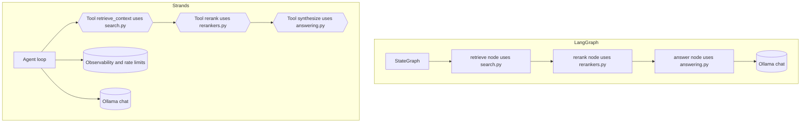

# RAG Codebase on Postgres + pgvector (Ollama-powered)

Local, production-ready Retrieval-Augmented Generation (RAG) for **code repositories** (TypeScript, Java, Node.js) using:

- **Postgres 16 + pgvector** for hybrid retrieval (vector + lexical + symbol boosts)  
- **Tree-sitter** for AST-aware chunking (function/class-level)  
- **Ollama** (local) for **embeddings** and **chat**  
- **FastAPI** retrieval service with:
  - a **LangGraph**-based agent  
  - a modern **Strands**-based agent (with rate limiting, observability, and tool APIs)  

---

## What you get

- **Clean schema** for repos → files → code chunks (+ AST metadata)  
- **Hybrid search**: vector similarity + BM25/tsvector + symbol/name boosts  
- **Local-only models**: embeddings via Ollama’s `mxbai-embed-large` (1024-dim), chat via `llama3.1:8b`  
- **Simple ingestion**: clone/parse/chunk/embed/index  
- **Agents**:  
  - **LangGraph Agent**: minimal graph that retrieves & answers with stitched, provenance-rich context  
  - **Strands Agent**: production-ready with **rate limits**, **tooling**, and **observability**  

---

## Repository layout

```
rag-pgvector/
├─ Dockerfile
├─ docker-compose.yml
├─ .dockerignore
├─ .env.example
├─ .gitignore
├─ Makefile
├─ QUICKSTART.MD
├─ db/
│  └─ migrations/
│      └─ 001_init.sql
└─ app/
   ├─ requirements.txt
   ├─ db.py                  # Postgres connection & helpers
   ├─ ingest.py              # repo ingest pipeline (clone → parse → embed → store)
   ├─ api.py                 # FastAPI app: search, graph, ask; wires modules below
   ├─ search.py              # hybrid retrieval (vector + BM25 + symbol boosts)
   ├─ rerankers.py           # candidate rerankers: CrossEncoder, LLM-based
   ├─ answering.py           # provenance-first synthesis + stitched context
   ├─ agent_graph.py         # LangGraph CLI demo agent
   └─ strands_agent.py       # Strands API demo agent with rate limits & observability
```

---

## Architecture (high-level)



---

## LangGraph vs Strands (at a glance)



**Key differences**  
- **Control flow**: LangGraph uses explicit nodes/edges; Strands uses an agent loop that calls tools as needed.  
- **Retrieval**: In LangGraph, retrieval is a node; in Strands, retrieval is a **Tool** the model can invoke.  
- **Ops features**: Strands sample includes **rate limits** and **metrics** hooks.  
- **Both** share the same Postgres+pgvector hybrid query and Ollama models.  

---

## ⚙️ Configuration

All runtime knobs are environment-driven.

```bash
cp .env.example .env
```

Key variables in `.env`:

```env
# Models
EMB_MODEL=mxbai-embed-large:latest
LLM_MODEL=llama3.1:8b
EMB_DIM=1024

# Strands Agent
STRANDS_TEMPERATURE=0.2
STRANDS_MAX_TOKENS=2048

# Strands Rate Limits
RL_MAX_CONCURRENCY=2
RL_RPM=60
RL_TPM=100000

# Logging
LOG_LEVEL=INFO
LOG_PREVIEW_CHARS=240

# Postgres DSN
DB_DSN=postgresql://rag:ragpwd@pg:5432/ragdb

# Ollama endpoint
OLLAMA_HOST=http://ollama:11434
OLLAMA_BASE_URL=http://ollama:11434
```

> **Note on dimensions:** The DB schema sets `embedding vector(1024)`. If you use a different embedding model (e.g., 768-dim), update both the env and DB column type accordingly (see “Changing embedding dimension” below).

---

## Docker Compose

The stack is defined in `docker-compose.yml` with additional one-shot services and health checks.

**Services**
- `pg` — Postgres 16 with pgvector; healthcheck via `pg_isready`; volume `pgdata` (persistent).  
- `ollama` — Ollama runtime on port `11434`; healthcheck `ollama list`; volume `ollama`.  
- `app` — FastAPI on port `8000`; depends on `pg`, `ollama`; command `uvicorn api:app --host 0.0.0.0 --port 8000`.  
- `migrate` — one-shot migration job that applies `db/migrations/*.sql` (profile: `init`).  
- `ingest` — one-shot ingestion job; uses `REPO_URLS` env (profile: `ingest`).  

**Volumes**
- `pgdata` → `/var/lib/postgresql/data`  
- `ollama` → `/root/.ollama`  

**Healthchecks**
- `pg` waits for DB readiness before app connects.  
- `ollama` validates the runtime can respond before app starts.  

---

## Quickstart

### 1) Bring up core services

```bash
docker compose up -d pg ollama
#To bring down all the services
docker compose down pg ollama app
docker compose --profile init run --rm migrate
docker compose build app 
docker compose up -d app
docker compose exec pg psql -U rag -d postgres -c "DROP DATABASE ragdb;" (low tech db reset)
docker compose exec pg psql -U rag -d postgres -c "CREATE DATABASE ragdb;" (run this before running migrate)
```

### 2) Pull models into Ollama

```bash
docker exec -it ollama ollama pull mxbai-embed-large
docker exec -it ollama ollama pull llama3.1:8b
```

### 3) Ingest repositories

```bash
REPO_URLS="https://github.com/expressjs/express.git,https://github.com/spring-projects/spring-petclinic.git" \
  docker compose --profile ingest up --build --exit-code-from ingest ingest
```

### 4) Try the retrieval API

```bash
curl "http://localhost:8000/search?q=jwt%20verification&code_language=java"
```

### 5) Run the agents

- **LangGraph CLI demo**

```bash
docker compose exec app python /workspace/app/agent_graph.py
```

- **Strands API demo**

```bash
curl -X POST http://localhost:8000/ask/strands   -H "Content-Type: application/json"   -d '{"question":"Where is JWT verification implemented?"}'
```

- **LangGraph API demo**

```bash
curl -X POST http://localhost:8000/ask/langgraph   -H "Content-Type: application/json"   -d '{"question":"Where is JWT verification implemented?"}'
```

---

## 🔌 API Reference

### Endpoints

| Method | Path                | Purpose                                        |
|-------:|---------------------|------------------------------------------------|
| GET    | `/search`           | Hybrid retrieval (vector + lexical)           |
| POST   | `/ask/strands`      | Ask a question via **Strands Agent**          |
| POST   | `/ask/langgraph`    | Ask a question via **LangGraph Agent**        |
| GET    | `/graph/relations`  | Show dependency relations for a file          |
| GET    | `/graph/impact`     | Show impact analysis of a file change         |

#### `/search` (retrieval only)

```bash
curl "http://localhost:8000/search?q=jwt%20verification&language=java"
```

**Response (abridged)**
```json
{
  "results": [
    {
      "id": 123,
      "repo_name": "spring-petclinic",
      "path": "src/main/java/.../JwtFilter.java",
      "language": "java",
      "symbol_name": "doFilter",
      "symbol_kind": "function",
      "symbol_signature": "public void doFilter(...)",
      "start_line": 12,
      "end_line": 90,
      "score": 1.234,
      "content": "..."
    }
  ],
  "stitched_context": "// spring-petclinic:src/...:12-90 [public void doFilter(...)]\n..."
}
```

#### `/ask/strands`

```bash
curl -X POST http://localhost:8000/ask/strands \
  -H "Content-Type: application/json" \
  -d '{"question":"Where is JWT verification implemented?"}'
```

**Response (example)**
```json
{
  "engine": "strands",
  "answer": "JWT verification is implemented in ... [repo:path:line-range signature]"
}
```

#### `/ask/langgraph`

```bash
curl -X POST http://localhost:8000/ask/langgraph \
  -H "Content-Type: application/json" \
  -d '{"question":"Where is JWT verification implemented?"}'
```

**Response (example)**
```json
{
  "engine": "langgraph",
  "answer": "JWT verification is implemented in ... [repo:path:line-range signature]"
}
```

#### `/graph/relations`

```bash
curl "http://localhost:8000/graph/relations?repo=spring-petclinic&file=Person.java&direction=both&depth=2"
```

#### `/graph/impact`

```bash
curl "http://localhost:8000/graph/impact?repo=spring-petclinic&file=Person.java&depth=2"
```

---

## Schema Overview

**Tables**
- `rag.repositories` ⇒ one per repo  
- `rag.commits` ⇒ commit metadata  
- `rag.files` ⇒ file metadata (language, size, test flag)  
- `rag.code_chunks` ⇒ function/class or windowed chunks  
  - columns: `content`, `embedding vector(1024)`, `content_tsv`, `symbol_name`, `symbol_kind`, `symbol_signature`, `doc_comment`, `imports JSONB`, `calls JSONB`, `committed_at`, `valid_from`, `valid_to`  
- `rag.chunk_edges` ⇒ optional relations (`calls`, `imports`, `implements`, `tests`)  
- `rag.v_chunk_search` ⇒ view joining chunks ↔ files ↔ repos  

**Indexes**
- `GIN(content_tsv)` for lexical/BM25  
- `IVFFLAT` on `embedding` (cosine) for ANN (or HNSW if supported)  
- B-tree on symbol fields and GIN on JSONB `imports`/`calls`  

---

## Retrieval Strategy

- **Vector similarity** with pgvector (cosine).  
- **Lexical search** with BM25 on code text.  
- **Symbol/name boost** for exact matches.  
- **Reranking** via `rerankers.py` (CrossEncoder or LLM judge).  
- **Synthesis** via `answering.py` with stitched context and inline provenance.  
- **Ordering**: `hybrid_score = w_vec*vec + w_lex*lex + w_sym*sym_boost`.  
- Tuning knobs: `top_k`, `w_vec`, `w_lex`, `w_sym`, plus filters like `language`, `repo`, `path_prefix`.

---

## Changing embedding dimension (if you use another model)

Current schema assumes **1024-dim** (`mxbai-embed-large`). To switch:

1. Choose a new Ollama embedding model (e.g., `nomic-embed-text` at 768-dim).  
2. Update `.env`:
   ```env
   EMB_MODEL=nomic-embed-text
   EMB_DIM=768
   ```
3. Adjust DB schema:
   ```sql
   -- Clear data if re-ingesting:
   TRUNCATE rag.code_chunks;
   DROP INDEX IF EXISTS code_chunks_embedding_ivfflat;
   ALTER TABLE rag.code_chunks ALTER COLUMN embedding TYPE vector(768);
   CREATE INDEX code_chunks_embedding_ivfflat
     ON rag.code_chunks USING ivfflat (embedding vector_cosine_ops) WITH (lists=100);
   ANALYZE rag.code_chunks;
   ```
4. Re-ingest repositories.  

If you want to preserve data, you must recompute embeddings to the new dimension.

---

## Production Hardening

- Put **auth** (API keys/JWT) in front of `/search` and `/ask/*`  
- Use **read-only DB roles** for the API  
- Enable **SSL** for Postgres (or run inside a trusted network)  
- Add **webhook/cron ingestion**, **idempotent staging**, **soft-deletes**, and **partitioning** for very large repos  
- Prefer **HNSW** indexes if your pgvector build supports it (strong for online inserts)  

---

## Troubleshooting

- **“dimension mismatch” / `cannot convert 1024-d to 768-d`**  
  Your embedding model dimension and `vector(N)` must match. See **Changing embedding dimension**.

- **Ollama healthcheck failing**  
  Ensure the `ollama` container has pulled the models:
  ```bash
  docker logs -f ollama
  docker exec -it ollama ollama list
  docker exec -it ollama ollama pull mxbai-embed-large
  ```
  
- **How to check if the language.so file is properly created for ast chuncking**
  ```bash
  docker compose exec app ls -l /opt/ts/my-languages.so
  docker compose exec app printenv TS_LANG_SO
  docker compose exec -T app python - <<'PY'
  import os
  from tree_sitter import Language
  p=os.environ.get("TS_LANG_SO"); print("TS_LANG_SO=", p)
  for name in ["java","typescript","javascript","python"]:
    try:
        Language(p, name)
        print("OK:", name)
    except Exception as e:
        print("FAIL:", name, e)
  PY


```
- **Reranker model missing / slow**  
  Disable reranking temporarily or reduce `top_k`; confirm GPU/CPU availability if using a CE model.

- **No stitched context**  
  Ensure `/search` includes `stitched_context`, and `answering.py` is used by `api.py`.

- **Slow queries after big ingests**  
  ```sql
  ANALYZE rag.code_chunks;
  ```
  Increase IVFFLAT `lists` (e.g., 100 → 200) and reindex.

---

## License

MIT (suggested)

---

## Commands Reference

```bash
# Build app
docker compose build app

# Start DB + Ollama
docker compose up -d pg ollama
docker compose --profile init run --rm ollama-init

# Run migration
docker compose --profile init run --rm migrate

# Start API
docker compose up -d app

# Pull models into Ollama
docker exec -it ollama ollama pull mxbai-embed-large
docker exec -it ollama ollama pull llama3.1:8b

# Ingest repos
REPO_URLS="https://github.com/expressjs/express.git" docker compose --profile ingest up --exit-code-from ingest ingest

# Test search
curl "http://localhost:8000/search?q=jwt%20verification&language=java"

# Test Strands Agent
curl -X POST http://localhost:8000/ask/strands   -H "Content-Type: application/json"   -d '{"question":"Where is JWT verification implemented?"}'

# Test LangGraph Agent
curl -X POST http://localhost:8000/ask/langgraph   -H "Content-Type: application/json"   -d '{"question":"Where is JWT verification implemented?"}'
```